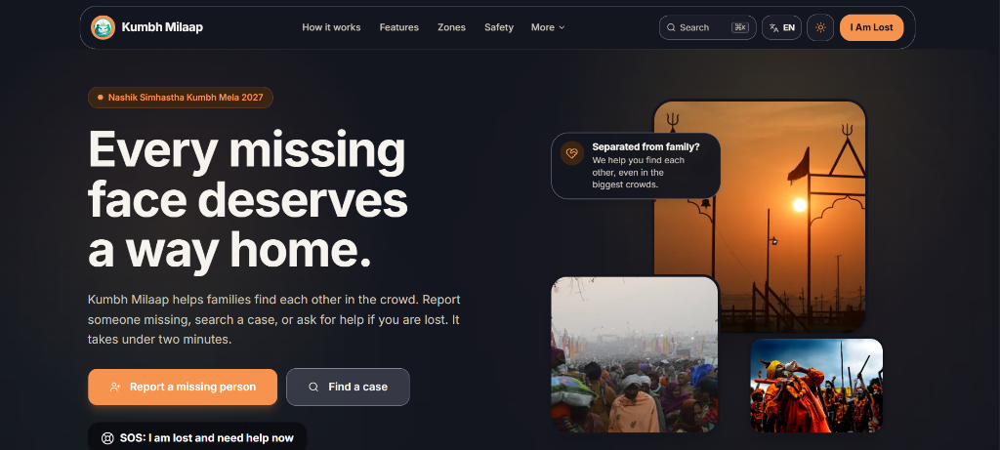
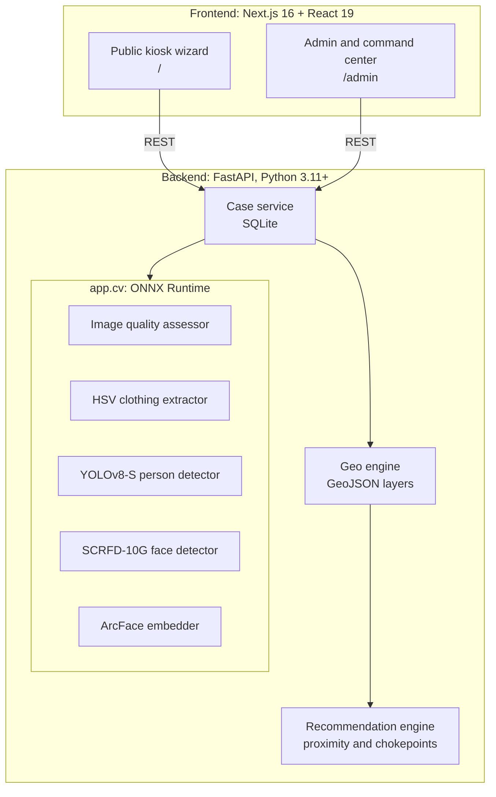
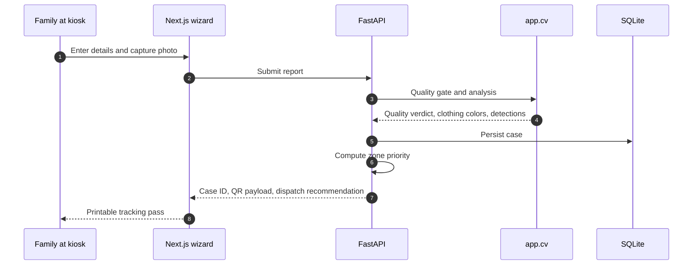
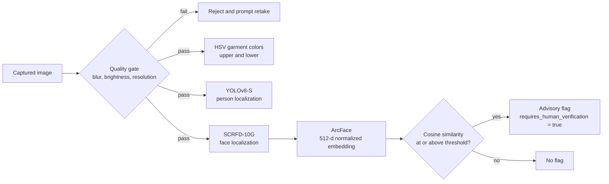

<div align="center">


# Kumbh Milaap

### Reuniting families at the Nashik Simhastha Kumbh Mela 2027

Kiosk-based missing-person intake, geospatial search triage, and advisory computer vision.<br/>
**A human officer is in charge of every decision.**

<br/>

[](https://nextjs.org/)
[](https://react.dev/)
[](https://www.typescriptlang.org/)
[](https://tailwindcss.com/)
[](https://fastapi.tiangolo.com/)
[](https://onnxruntime.ai/)
[](https://www.docker.com/)

<br/>

**[Quick Start](#-quick-start)** &nbsp;·&nbsp; **[How It Works](#-how-it-works)** &nbsp;·&nbsp; **[Features](#-features)** &nbsp;·&nbsp; **[Configuration](#-configuration)** &nbsp;·&nbsp; **[Privacy](#-privacy-and-responsible-ai)** &nbsp;·&nbsp; **[Roadmap](#-roadmap)**

</div>

<br/>

<p align="center">
  
</p>

> [!IMPORTANT]
> **Every match is a flag, never a decision.** Kumbh Milaap never auto-identifies or auto-resolves a case. All candidate matches require verification by a human officer.

---

##  At a Glance

The Nashik Simhastha Kumbh Mela 2027 is expected to draw tens of millions of pilgrims to the Godavari riverbanks. In dense crowds, with loud surroundings and patchy mobile networks, people get separated from their families every day, most often children and the elderly. Paper registers and loudspeaker announcements burn the first, most important hours.

**Kumbh Milaap replaces ad-hoc searching with a four-stage pipeline:**

|                                                                                                                                       | Stage      | What happens                                                                                                                                       |
| :-----------------------------------------------------------------------------------------------------------------------------------: | ---------- | -------------------------------------------------------------------------------------------------------------------------------------------------- |
|  | **Intake** | A guided kiosk wizard with live webcam capture issues a printable tracking pass with a Case ID and QR code.                                        |
|      | **Triage** | A rule-based engine ranks zones, gates, and CCTV checkpoints so search teams know where to go first.                                               |
|             | **Vision** | Quality-gated image analysis extracts clothing colors, detects people and faces, and can compute advisory face embeddings. All of it runs locally. |
|   | **Review** | A human officer verifies every candidate match before any action is taken.                                                                         |

|  Families & volunteers |  Search teams |  Control-room officers |
| ---------------------------------------------------------------------------------------------------------------------------------------------------------- | ----------------------------------------------------------------------------------------------------------------------------------- | ------------------------------------------------------------------------------------------------------------------------------------------------------ |
| File reports at kiosks                                                                                                                                     | Receive dispatch directives                                                                                                         | Review and verify cases                                                                                                                                |

---

##  Quick Start

### Choose your path

|                                                                                                                                                                           | Best for                         | Time   |
| ------------------------------------------------------------------------------------------------------------------------------------------------------------------------- | -------------------------------- | ------ |
| **[ Docker Compose](#-option-1-docker-compose)**     | Trying it out, one-command setup | ~2 min |
| **[ Manual setup](#-option-2-manual-setup)** | Development and debugging        | ~5 min |

<details>
<summary><b> Prerequisites</b></summary>

<br/>

| Tool               | Version                                                                   |
| ------------------ | ------------------------------------------------------------------------- |
| Python             | 3.11+                                                                     |
| Node.js            | Any version supported by Next.js 16                                       |
| Docker and Compose | Optional, for the one-command path                                        |
| ONNX model weights | Only for person, face, and embedding features ([details](#model-weights)) |

</details>

###  Option 1: Docker Compose

```bash
docker compose up --build
```

Then open:

| Service                                                                                                                                           | URL                         |
| ------------------------------------------------------------------------------------------------------------------------------------------------- | --------------------------- |
|  Frontend (kiosk)           | http://localhost:3000       |
|  API docs (Swagger)             | http://localhost:8000/docs  |
|  API docs (ReDoc) | http://localhost:8000/redoc |

###  Option 2: Manual setup

**1. Backend**

```bash
cd backend
python -m venv venv

# Windows
.\venv\Scripts\activate
# Linux / macOS
source venv/bin/activate

pip install -r requirements.txt
python run.py
```

**2. Frontend** _(in a new terminal)_

```bash
cd frontend
npm install
echo "NEXT_PUBLIC_API_URL=http://localhost:8000" > .env.local
npm run dev
```

> [!TIP]
> Quality gating and clothing color analysis work **without any model weights**. You only need `.onnx` files for person detection, face detection, and embeddings.

### Model weights

The vision pipeline loads `.onnx` files from `KUMBH_CV_MODELS_DIR` (default `runtime/models`). Place the YOLOv8-Small, SCRFD-10G, and ArcFace weights there before enabling person detection, face detection, or embeddings.

> [!WARNING]
> Upstream checkpoints carry license restrictions. **Read [Model Licensing](#model-licensing) before downloading.**

<details>
<summary><b> Troubleshooting</b></summary>

<br/>

| Problem                          | Fix                                                                                                                   |
| -------------------------------- | --------------------------------------------------------------------------------------------------------------------- |
| Camera does not start            | Browsers only allow webcam access on `localhost` or HTTPS. Grant permission and verify no other app holds the camera. |
| CORS errors in the browser       | Add the frontend origin to `KUMBH_CORS_ORIGINS`.                                                                      |
| Vision endpoints fail on startup | Confirm the `.onnx` files exist in `KUMBH_CV_MODELS_DIR` with the expected filenames.                                 |
| `cuda` or `dml` device not used  | Install the matching ONNX Runtime build for your hardware, or set `KUMBH_CV_DEVICE=cpu`.                              |

</details>

---

##  Features

###  Public kiosk and report wizard

- **Built for stress:** large touch targets and clear step progression.
- **Collects:** name, age, gender, last seen location, time elapsed, clothing description, and emergency contact.
- **Live webcam capture** with client-side compression and quality checks, plus a file upload fallback.
- **Instant printable search card** with Case ID and scannable tracking QR code.

###  Geospatial triage and priority engine

- Scores search zones using **elapsed time**, **chokepoint proximity**, and **camera density**.
- Produces concrete dispatch directives instead of generic alerts:

  >  Deploy Search Team to **Ramkund Ghat**, then **Gate 4**, then **CCTV Post 12** &nbsp;`Priority Score: 94/100`

- Interactive Leaflet map with toggleable GeoJSON layers: Mela sectors, police stations, medical camps, ghats, and CCTV posts.

###  Modular computer vision (`app.cv`)

| Module                    | What it does                                                                                                              |
| ------------------------- | ------------------------------------------------------------------------------------------------------------------------- |
| **Quality gate**          | Laplacian-variance blur check, brightness check, and resolution validation                                                |
| **Clothing colors**       | HSV-based upper and lower garment classifier tuned for pilgrimage attire (saffron, white, red, blue, green, yellow, dark) |
| **Detection**             | YOLOv8-Small for people and SCRFD-10G for faces, via ONNX Runtime on CPU, CUDA, or DirectML                               |
| **Advisory verification** | ArcFace 512-d normalized embeddings for candidate similarity                                                              |

###  Command center and admin dashboard

- **Live metrics:** total reports, active searches, verified matches, reunited cases.
- **Fuzzy lookup** by name, Case ID, status, or zone using `rapidfuzz`.
- **Case lifecycle** with audit timestamps on every transition:

  `ACTIVE` → `INVESTIGATING` → `FOUND` → `CLOSED`

---

##  How It Works

### System architecture



### Intake flow



### Vision pipeline



Normalized vectors make cosine similarity a plain dot product.

### Design decisions

| Decision                                                                                                                                                         | Why                                                                                                                                       |
| ---------------------------------------------------------------------------------------------------------------------------------------------------------------- | ----------------------------------------------------------------------------------------------------------------------------------------- |
|  **Local-first inference**            | Models run through ONNX Runtime on the host, so no image or embedding leaves the deployment and kiosks keep working on poor connectivity. |
|  **Hardware-agnostic**          | One setting (`KUMBH_CV_DEVICE`) switches between a CPU-only kiosk and a GPU command server.                                               |
|  **Rules over black boxes for triage** | Zone ranking is explainable, so officers can see why a zone scored high and retune it.                                                    |
|  **Advisory-only matching**          | Similarity produces flags that need human verification, never automatic identification.                                                   |

---

##  Configuration

### Backend

Set in `backend/.env` or as environment variables.

| Variable                             | Default                     | Description                                              |
| ------------------------------------ | --------------------------- | -------------------------------------------------------- |
| `KUMBH_API_VERSION`                  | `1.0.0`                     | API version tag                                          |
| `KUMBH_LOG_LEVEL`                    | `INFO`                      | `DEBUG`, `INFO`, `WARNING`, or `ERROR`                   |
| `KUMBH_CORS_ORIGINS`                 | `http://localhost:3000,...` | Comma-separated allowed origins                          |
| `KUMBH_CV_DEVICE`                    | `cpu`                       | Inference provider: `cpu`, `cuda`, or `dml`              |
| `KUMBH_CV_MODELS_DIR`                | `runtime/models`            | Directory containing `.onnx` weights                     |
| `KUMBH_CV_BLUR_THRESHOLD`            | `50.0`                      | Minimum Laplacian variance for a frame to count as sharp |
| `KUMBH_CV_YOLO_CONF`                 | `0.35`                      | Minimum confidence for person detections                 |
| `KUMBH_CV_SCRFD_CONF`                | `0.50`                      | Minimum confidence for face detections                   |
| `KUMBH_CV_MATCH_CANDIDATE_THRESHOLD` | `0.65`                      | Cosine similarity needed to raise a candidate-match flag |

### Frontend

```env
NEXT_PUBLIC_API_URL=http://localhost:8000
```

<details>
<summary><b> Tuning guide</b></summary>

<br/>

| Symptom                               | Adjust                                              |
| ------------------------------------- | --------------------------------------------------- |
| Good photos rejected as blurry        | Lower `KUMBH_CV_BLUR_THRESHOLD`                     |
| Blurry frames getting through         | Raise `KUMBH_CV_BLUR_THRESHOLD`                     |
| Missed people or faces in crowds      | Lower `KUMBH_CV_YOLO_CONF` or `KUMBH_CV_SCRFD_CONF` |
| Spurious detections                   | Raise the same two values                           |
| Too many candidate flags for officers | Raise `KUMBH_CV_MATCH_CANDIDATE_THRESHOLD`          |
| True candidates missed                | Lower `KUMBH_CV_MATCH_CANDIDATE_THRESHOLD`          |

</details>

> [!NOTE]
> Lowering the match threshold trades officer workload for recall. Calibrate it on representative data before field deployment.

---

##  Privacy and Responsible AI

Kumbh Milaap is built around privacy-by-design principles, with India's Digital Personal Data Protection (DPDP) Act in mind.

| Principle                                                                                                                                                   | Implementation                                                                                                                        |
| ----------------------------------------------------------------------------------------------------------------------------------------------------------- | ------------------------------------------------------------------------------------------------------------------------------------- |
|  **Biometric isolation**                  | Face embeddings are treated as sensitive identifiers and excluded from public listings, unauthenticated endpoints, and printed cards. |
|  **Human in the loop**  | Matches are advisory flags (`requires_human_verification = true`). The system never auto-resolves or auto-identifies a case.          |
|  **No third-party cloud**   | Inference runs on-premise or on the edge kiosk. Biometric data is not sent to external commercial APIs.                               |
|  **Auditability** | Status transitions carry timestamps so every case change can be audited and traced.                                                   |

### Model Licensing

> [!WARNING]
> Pretrained face and detection models often have restrictive licenses. Verify the current terms of each checkpoint before operational use.

| Component                           | Things to check                                                                                                        |
| ----------------------------------- | ---------------------------------------------------------------------------------------------------------------------- |
| **YOLOv8** (Ultralytics)            | Distributed under AGPL-3.0, with a separate enterprise license. AGPL obligations can apply when served over a network. |
| **SCRFD and ArcFace** (InsightFace) | Code is open source, but published pretrained weights have historically been limited to non-commercial research use.   |

For operational deployment, replace restricted checkpoints with permissively licensed (e.g., Apache-2.0 Glint360k) or self-trained weights.

---

##  Known Limitations

<details>
<summary><b>Read before field deployment</b></summary>

<br/>

- **Face matching in crowds is advisory.** Crowds, harsh sun glare, shawls, and low-resolution sensors impact accuracy. Children present additional challenges due to rapid facial changes.
- **HSV clothing colors are lighting-sensitive.** Direct sunlight and deep shadow can shift measured hues, and heavily patterned attire reduces classifier confidence.
- **Triage is heuristic.** Zone priority scores use deterministic domain rules rather than learned crowd movement models.
- **Single-node SQLite by default.** Designed for standalone edge kiosks; multi-site coordination requires database replication.
- **Human verification is mandatory.** The system outputs candidate flags to assist officers, never automated reunions.

</details>

---

##  Roadmap

- [ ]  **Voice-assisted intake:** multilingual audio prompts and voice transcription in Hindi, Marathi, and Gujarati for low-literacy pilgrims
- [ ]  **Offline mesh sync:** peer-to-peer queue synchronization between disconnected help desks over local Wi-Fi or LoRa
- [ ]  **Broadcast integration:** automated export format for Mela Authority Public Address (PA) and LED information displays
- [ ]  **Wristband / tag scanning:** barcode and NFC quick-intake for pre-registered elderly pilgrims and children
- [ ]  **Zero-knowledge proof of reunion:** cryptographic verification token generated on verified reunion for automatic audit log closure and biometric purging

---

##  Contributing

1. **Fork** the repository and create a feature branch.
2. **Keep changes focused** and include tests for new functionality.
3. **Run checks** before opening a pull request:
   ```bash
   pytest
   npm run build
   npm run test:unit
   ```
4. **Never commit** model weights, API secrets, or real personally identifiable information (PII).

---

##  Acknowledgements

[Next.js](https://nextjs.org/) · [FastAPI](https://fastapi.tiangolo.com/) · [ONNX Runtime](https://onnxruntime.ai/) · [Leaflet](https://leafletjs.com/) · [OpenStreetMap](https://www.openstreetmap.org/) contributors · [rapidfuzz](https://github.com/rapidfuzz/RapidFuzz) · and the open-source computer vision community.

<div align="center">

<br/>

_Built so that no family spends their first hours searching alone._

</div>
