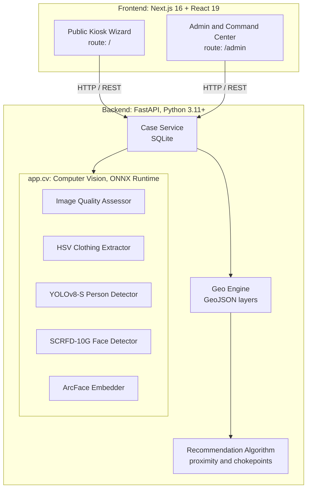
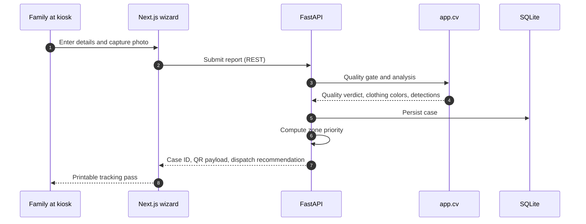
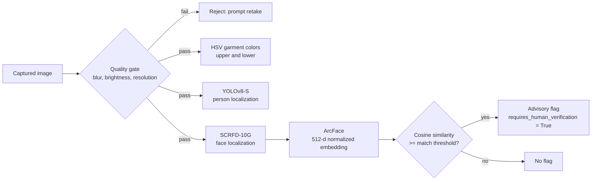

<div align="center">

#  Kumbh Milaap

### _Reuniting Families, One Connection at a Time_

**Geospatial triage, edge-ready kiosk intake, and responsible computer vision for the Nashik Simhastha Kumbh Mela 2027**

<br/>

[](https://nextjs.org/)
[](https://fastapi.tiangolo.com/)
[](https://tailwindcss.com/)
[](https://onnxruntime.ai/)
[](https://leafletjs.com/)
[](https://www.docker.com/)
[](#privacy)

<br/>

[Overview](#overview) · [Features](#features) · [Architecture](#architecture) · [Quick Start](#quick-start) · [Configuration](#configuration) · [Computer Vision](#computer-vision) · [Privacy](#privacy) · [Model Licensing](#model-licensing)

</div>

---

> **Millions of pilgrims. Thousands of separations. Minutes that matter.**
> Kumbh Milaap is a kiosk-based system that helps volunteers and authorities register missing-person reports at the point of need, triage them geospatially, and surface candidate matches for human review, with privacy and consent built in from the start.

---

<a id="overview"></a>
##  Overview

The **Nashik Simhastha Kumbh Mela 2027** will host tens of millions of pilgrims along the Godavari River. In dense crowds, with high ambient noise and intermittent cellular connectivity, thousands of people, predominantly elderly individuals and young children, are separated from their families every day. Paper registers and loudspeaker announcements waste the critical early hours.

**Kumbh Milaap (KHOJ)** replaces ad-hoc search with a structured pipeline:

| Stage | What it does |
|---|---|
| **1. Intake** | Guided multi-step kiosk wizard with live webcam capture. Issues a printable tracking pass with a unique Case ID and QR code. |
| **2. Triage** | Heuristic engine ranks zones, gates, and CCTV checkpoints so search teams know where to go first. |
| **3. Vision** | Quality-gated image analysis, garment color classification, person and face detection, and optional advisory face embeddings, all running locally. |
| **4. Review** | Every candidate match is an advisory flag. A human officer must verify it before any action is taken. |

---

<a id="features"></a>
##  Features

<details open>
<summary> <b>Public kiosk and report wizard</b></summary>
<br/>

- Large touch targets, clear step progression, and a multilingual-ready layout for high-stress use.
- Collects name, age, gender, last seen location, time elapsed, clothing description, and emergency contact.
- Live webcam snapshot via `react-webcam`, or file upload as a fallback.
- Instant printable search card with Case ID and scannable tracking QR code.

</details>

<details open>
<summary> <b>Geospatial triage and priority engine</b></summary>
<br/>

- Scores search zones using elapsed time, chokepoint proximity, and camera density.
- Emits concrete dispatch directives instead of generic alerts:
  > _"Deploy Search Team to Ramkund Ghat → Gate 4 → CCTV Post 12 (Priority Score: 94/100)"_
- Interactive Leaflet map with toggleable GeoJSON layers: Mela sectors, police stations, medical camps, ghats, and CCTV posts.

</details>

<details open>
<summary> <b>Modular computer vision (<code>app.cv</code>)</b></summary>
<br/>

- **Quality gating:** Laplacian-variance blur check, brightness check, and resolution validation.
- **Garment colors:** HSV-space upper and lower clothing classifier tuned for pilgrimage attire (Saffron/Bhagwa, White, Red, Blue, Green, Yellow, Dark/Black).
- **Detection:** YOLOv8-Small (person) and SCRFD-10G (face) via ONNX Runtime on CPU, CUDA, or DirectML.
- **Advisory verification:** ArcFace 512-dimensional normalized embeddings for candidate similarity.

</details>

<details open>
<summary> <b>Command center and admin dashboard</b></summary>
<br/>

- Live metrics: total reports, active searches, verified matches, reunited cases.
- Fuzzy lookup by name, case ID, status, or zone using `rapidfuzz`.
- Case lifecycle `ACTIVE → INVESTIGATING → FOUND → CLOSED` with audit timestamps.

</details>

---

<a id="architecture"></a>
##  Architecture



### Intake flow



### Design decisions

- **Local-first inference.** All models run through ONNX Runtime on the host. No image or embedding leaves the deployment, which also keeps kiosks usable under poor connectivity.
- **Hardware-agnostic.** Execution provider is a single setting (`KUMBH_CV_DEVICE`), so the same build runs on a CPU-only kiosk or a GPU-equipped command server.
- **Heuristics over black boxes for triage.** Zone ranking is rule-based, so officers can see why a zone scored highly and operators can retune it.
- **Advisory-only matching.** Similarity scores produce flags, never decisions (see [Privacy](#privacy)).

---

<a id="quick-start"></a>
##  Quick Start

### Prerequisites

| Tool | Version |
|---|---|
| Python | 3.11+ |
| Node.js | A version supported by Next.js 16 |
| Docker + Compose | Optional, for the one-command path |
| ONNX model weights | Required only for the vision features; see [Model weights](#model-weights) |

### Option 1: Docker Compose (recommended)

```bash
docker compose up --build
```

| Service | URL |
|---|---|
| Frontend | http://localhost:3000 |
| API docs (Swagger) | http://localhost:8000/docs |
| API docs (ReDoc) | http://localhost:8000/redoc |

### Option 2: Manual local development

**Backend**

```bash
cd backend

python -m venv venv
# Windows
.\venv\Scripts\activate
# Linux / macOS
source venv/bin/activate

pip install -r requirements.txt
python run.py          # http://localhost:8000
```

**Frontend** (separate terminal)

```bash
cd frontend
npm install
echo "NEXT_PUBLIC_API_URL=http://localhost:8000" > .env.local
npm run dev            # http://localhost:3000
```

<a id="model-weights"></a>
### Model weights

The vision pipeline loads `.onnx` files from `KUMBH_CV_MODELS_DIR` (default `runtime/models`). Place the YOLOv8-Small, SCRFD-10G, and ArcFace weights there before enabling person detection, face detection, or embeddings. Check [Model Licensing](#model-licensing) first, since the upstream checkpoints carry restrictions.

---

<a id="configuration"></a>
##  Configuration

### Backend (`backend/`)

Set via `.env` or environment variables.

| Variable | Default | Description |
|---|---|---|
| `KUMBH_API_VERSION` | `1.0.0` | API version tag |
| `KUMBH_LOG_LEVEL` | `INFO` | `DEBUG`, `INFO`, `WARNING`, or `ERROR` |
| `KUMBH_CORS_ORIGINS` | `http://localhost:3000,...` | Comma-separated allowed origins |
| `KUMBH_CV_DEVICE` | `cpu` | Inference provider: `cpu`, `cuda`, or `dml` |
| `KUMBH_CV_MODELS_DIR` | `runtime/models` | Directory containing `.onnx` weights |
| `KUMBH_CV_BLUR_THRESHOLD` | `50.0` | Minimum Laplacian variance for a frame to count as sharp |
| `KUMBH_CV_YOLO_CONF` | `0.35` | Minimum confidence for person detections |
| `KUMBH_CV_SCRFD_CONF` | `0.50` | Minimum confidence for face detections |
| `KUMBH_CV_MATCH_CANDIDATE_THRESHOLD` | `0.65` | Cosine similarity needed to raise a candidate-match flag |

### Frontend (`frontend/.env.local`)

```env
NEXT_PUBLIC_API_URL=http://localhost:8000
```

### Tuning guide

| Symptom | Adjust |
|---|---|
| Good photos rejected as blurry | Lower `KUMBH_CV_BLUR_THRESHOLD` |
| Blurry frames reaching the index | Raise `KUMBH_CV_BLUR_THRESHOLD` |
| Missed people or faces in crowds | Lower `KUMBH_CV_YOLO_CONF` / `KUMBH_CV_SCRFD_CONF` |
| Spurious detections | Raise the same two values |
| Too many candidate flags for officers to review | Raise `KUMBH_CV_MATCH_CANDIDATE_THRESHOLD` |
| Missing true candidates | Lower `KUMBH_CV_MATCH_CANDIDATE_THRESHOLD` |

Lowering the match threshold trades officer workload for recall. Calibrate it on representative data before field use.

---

<a id="computer-vision"></a>
##  Computer Vision Pipeline



| Module | Technique | Notes |
|---|---|---|
| Quality assessor | Laplacian variance, brightness, resolution checks | Stops low-quality frames from polluting index records |
| Clothing extractor | HSV color-space classification | Tuned for saffron, white, and other common pilgrimage garments |
| Person detector | YOLOv8-Small, ONNX | Confidence floor via `KUMBH_CV_YOLO_CONF` |
| Face detector | SCRFD-10G, ONNX | Confidence floor via `KUMBH_CV_SCRFD_CONF` |
| Embedder | ArcFace, 512-d, L2-normalized | Because vectors are normalized, cosine similarity reduces to a dot product |

---

<a id="privacy"></a>
##  Privacy and Responsible AI

Kumbh Milaap is designed to align with India's **Digital Personal Data Protection (DPDP) Act**. The controls below are enforced in the system's design.

| Principle | Implementation |
|---|---|
| **Biometric isolation** | Raw face embeddings are treated as sensitive identifiers and are excluded from public listings, unauthenticated endpoints, and printed cards. |
| **Human in the loop** | Matches are advisory flags (`requires_human_verification = True`). The system never auto-resolves or auto-identifies a case. |
| **No third-party cloud** | Inference runs on-premise or on the edge kiosk. Biometric data is not sent to external APIs. |
| **Auditability** | Status transitions carry timestamps so every case change can be traced. |

> This section describes engineering controls, not legal advice. Operational deployment should be reviewed against the Act and the organizing authority's data-handling requirements.

---

<a id="model-licensing"></a>
##  Model Licensing

Model licenses may block commercial or government deployment. Review them before shipping.

| Model | Upstream license | Guidance |
|---|---|---|
| **YOLOv8 (Ultralytics)** | AGPL-3.0 or commercial | Obtain a commercial license, or swap in a permissively licensed detector (for example Apache-2.0) for proprietary deployments. |
| **SCRFD / ArcFace (InsightFace)** | Upstream research checkpoints are limited to non-commercial academic evaluation | For operational use, train or source weights on permissively licensed data (for example Apache-2.0 Glint360k-based weights). |
